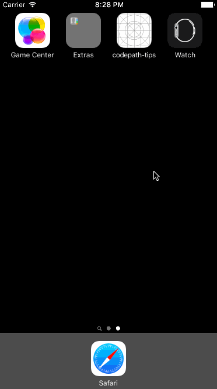

# codepath-tips

codepath-tips is a tip calculator application for iOS.

Submitted by: Sean Crenshaw

Time spent: 5-6 hours spent in total

This app allows the user to enter a bill amount, choose a tip percentage, and see the tip and total values. The user can also set the default tip percentage in the settings.

The app remembers the user's default tip percentage across app restarts. It also makes sure that the keyboard is always visible and the bill amount is always the first responder.

## Video Walkthrough 

Here's a walkthrough of implemented user stories:

GIF created with [LiceCap](http://www.cockos.com/licecap/).
